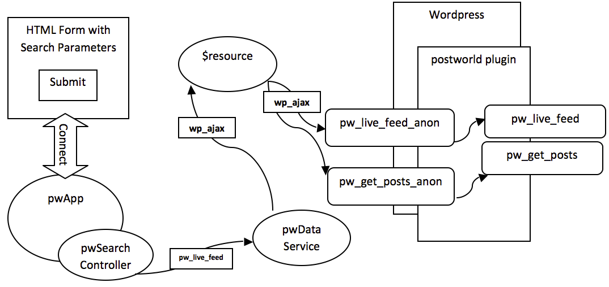

Structure
======

The following describes the structure of the service/ajax part and the chain of actions from the html page till the wordpress function and back to html again.

**search-results.php** - a page template that creates an ngApp with a form that takes search parameters and returns back search results.

**app.js** - contains pwApp - the postworld AngularJS Application and Modules. A single route is created that routes this app by default to a test page with a test Search Controller.

**pwSearchController.js** - contains pwSearchController - a sandbox Controller for testing the service and the Search UI. This controller gets search parameters from a form and initiates pwData service to get search results back to the page.

**pwData.js** - contains pwData Service- an Angular Service that initiates all Ajax Calls to wordpress, through one common function wp_ajax. wp_ajax gets function name, combined arguments; then it calls the $resource service with a custom post method to call wordpress using Ajax actions.

**postworld_ajax.php** - contains ajax hooks and functions that trigger the ajax calls and then call the corresponding wordpress function from within the plugin. currently we are using pw_live_feed as a test function, with actually having it call the pw_query function

